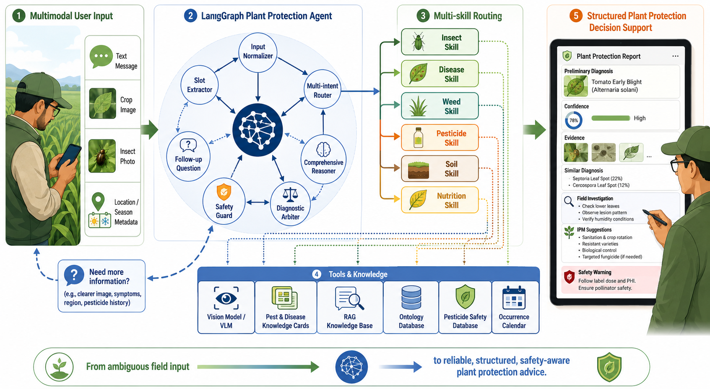

# Plant Protection Agent / 植保智能体

基于 **LangGraph** 的多模态、多 Skill、RAG 增强、可追问、可仲裁、可安全约束的植保专业智能体。

[](https://github.com/langchain-ai/langgraph)
[](https://deepseek.com)
[](pyproject.toml)
[](LICENSE)

---

## 核心能力

| 能力 | 说明 | 状态 |
|------|------|------|
| **多意图并发** | 同时识别虫害、病害、药害、营养等多种可能 | ✅ DeepSeek API 驱动 |
| **多路由分发** | 并发调用多个子 Skill 进行分析 | ✅ ThreadPoolExecutor 并行 |
| **综合诊断仲裁** | 证据交叉矩阵 + 置信度校准 | ✅ EvidenceMatrix 引擎 |
| **RAG 知识检索** | TF-IDF 向量检索 580 条知识索引 | ✅ 零外部依赖 |
| **信息充分性检查** | 信息不足时主动追问，不强行诊断 | ✅ 5 因子置信度衰减 |
| **安全合规检查** | 每轮输出前必须经过 Safety Guard | ✅ 禁限用药+剂量拦截 |
| **LLM 驱动** | DeepSeek API + Mock 降级 | ✅ API Key 配置即用 |
| **可扩展 Skill** | 8 个子 Skill 统一协议 | ✅ 独立开发/注册 |


## 子 Skill 一览

| Skill | 领域 | 说明 |
|-------|------|------|
| Insect | 🐛 **虫害** | 害虫识别、形态鉴别、IPM 建议（RAG 知识增强） |
| Disease | 🍂 **病害** | 真菌/细菌/病毒/生理性病害 |
| Weed | 🌿 **草害** | 杂草识别与防除 |
| Pesticide | 🧪 **农药** | 农药知识、作用机制、登记查询 |
| Pesticide Injury | ⚠️ **药害** | 药害判断与排除 |
| Soil | 🪨 **土壤** | 板结/盐渍化/酸碱度/根系环境 |
| Nutrition | 🌱 **营养** | 缺素诊断（N/P/K/Mg/Fe 等） |
| Comprehensive | 🔗 **综合** | 跨领域多因素综合分析 |

## 快速开始

### 1. 配置 API Key

```bash
# 复制环境变量模板
cp .env.example .env

# 编辑 .env，填入 DeepSeek API Key
# DEEPSEEK_API_KEY=sk-your_key_here
# DEEPSEEK_MODEL=deepseek-chat
```

### 2. 安装依赖

```bash
pip install langgraph langchain-core
```

### 3. 运行 CLI

```bash
python app/main.py

# 示例对话
>> 水稻分蘖期出现枯心苗，叶片有小白虫
```

### 4.（可选）构建 RAG 索引

```bash
python -m knowledge.pipeline.indexer build --force-rebuild
```

---

## 项目结构

```
├── README.md                       # 本文件
├── pyproject.toml                  # 项目配置
├── requirements.txt                # 依赖
├── .env.example                    # 环境变量模板
├── .env                            # 本地配置（已 gitignore）
│
├── app/                            # 应用入口与 API
│   ├── main.py                     #   CLI + API 入口
│   ├── config.py                   #   配置管理
│   └── api/                        #   FastAPI 路由
│
├── graph/                          # LangGraph 主图
│   ├── state.py                    #   全局 State（50+ 字段）
│   ├── build_graph.py              #   图编译
│   ├── llm/                        #   LLM 抽象层
│   │   └── client.py               #   DeepSeek API + Mock 降级
│   ├── reasoning/                  #   推理引擎
│   │   ├── evidence_matrix.py      #   证据交叉矩阵
│   │   └── confidence_calibrator.py#   置信度校准器
│   ├── nodes/                      #   11 个节点函数
│   │   ├── intent_router_v2.py     #   LLM 多意图路由
│   │   ├── domain_dispatcher.py    #   并发 Skill 分发
│   │   ├── comprehensive_reasoner.py# 证据矩阵推理
│   │   ├── diagnostic_arbiter.py   #   诊断仲裁
│   │   └── ...
│   └── edges/                      #   条件路由
│
├── skills/                         # 子 Skill 集合
│   ├── base.py                     #   SkillBase 抽象
│   ├── insect/                     #   🐛 RAG 知识增强
│   ├── disease/                    #   🍂
│   ├── weed/                       #   🌿
│   ├── pesticide/                  #   🧪
│   ├── pesticide_injury/           #   ⚠️
│   ├── soil/                       #   🪨
│   ├── nutrition/                  #   🌱
│   └── comprehensive/              #   🔗
│
├── tools/                          # 工具层
│   ├── vision/                     #   视觉/多模态
│   ├── retrieval/                  #   知识检索（RAG）
│   │   ├── vector_retriever.py     #     向量检索
│   │   ├── keyword_retriever.py    #     关键词检索
│   │   ├── hybrid_retriever.py     #     混合检索+RRF
│   │   └── reranker.py             #     重排（预留BGE）
│   ├── database/                   #   数据库查询
│   └── safety/                     #   安全检查
│
├── knowledge/                      # 统一知识库 + RAG 流水线
│   ├── pipeline/                   #   RAG 引擎
│   │   ├── chunker.py              #     文档分块
│   │   ├── embedder.py             #     TF-IDF 嵌入
│   │   ├── vector_store.py         #     向量存储+检索
│   │   └── indexer.py              #     索引构建 CLI
│   ├── indexes/                    #   构建好的向量索引
│   │   └── pest_knowledge.vectors.json  # 580 条
│   ├── ontology/                   #   5 领域本体
│   ├── cards/                      #   知识卡片
│   └── sources/                    #   来源登记
│
├── prompts/                        # 7 个 LLM Prompt 模板
├── tests/                          # 测试用例与评测
│   ├── test_cases/                 #   5 类 JSONL 测试
│   └── eval/                       #   5 个评测脚本
│
└── docs/                           # 7 份架构文档
```

## 工作流概览

```
[用户输入]
    │
    ▼
Input Normalizer
    │
    ▼
Slot Extractor
    │
    ▼
Intent Router ─── LLM (DeepSeek API) 多意图识别
    │
    ├── 有图片 → Image Analyzer
    └── 无图片 → Sufficiency Checker
                    │
                ┌───┴───┐
            [不足]      [充分]
                │          │
        Follow-up       Domain Dispatcher ─── ThreadPoolExecutor 并发
        Generator           │
            │           ┌──┼──┬──┬──┬──┬──┬──┐
            ▼           │ insect disease ... │
           END          └──┴──┴──┴──┴──┴──┴──┘
                            │
                    Comprehensive Reasoner ─── EvidenceMatrix 交叉分析
                            │
                    Diagnostic Arbiter ─── ConfidenceCalibrator 校准
                            │
                    Safety Guard ─── 禁限用药/剂量拦截
                            │
                    Answer Formatter ─── 结构化输出
                            │
                           END
```

## 技术栈

| 层 | 技术选型 |
|----|----------|
| **图编排** | LangGraph StateGraph |
| **LLM** | DeepSeek Chat API（OpenAI 兼容），Mock 降级 |
| **RAG 向量** | TF-IDF 256 维（零依赖），预留 BGE-M3/Qdrant |
| **知识分块** | Markdown heading-based，800 chars/块 |
| **并发** | ThreadPoolExecutor |
| **API** | FastAPI（可选） |
| **测试** | Python unittest + JSONL 用例 |

## 评测指标

| 模块 | 指标 | 当前值 |
|------|------|--------|
| 意图识别 | 领域准确率 | 62%（DeepSeek API） |
| 多意图 | 召回率 | 100% |
| 槽位抽取 | 关键槽位准确率 | 87.5% |
| 追问触发 | 关键缺失追问率 | 100% |
| RAG 检索 | 索引量 | 580 条 |

## 当前阶段

**MVP 1 — 文本诊断 + DeepSeek API + RAG**：工程骨架已搭建，节点使用 DeepSeek API（Mock 降级），RAG 索引 580 条知识，可跑通完整诊断链路。

### 开发路线

| 阶段 | 目标 | 状态 |
|------|------|------|
| MVP 0 | 工程骨架 + Mock 节点 | ✅ |
| MVP 1 | DeepSeek API + 多意图路由 | ✅ |
| MVP 1.5 | RAG 向量检索 + 知识索引 | ✅ |
| MVP 2 | 图片输入 + 多模态分析 | 📅 |
| MVP 3 | 农药安全 + 完整合规 | 📅 |
| MVP 4 | 全 Skill 扩展 + 评测 | 📅 |

---

*详见 `docs/` 目录下的架构设计文档。*
