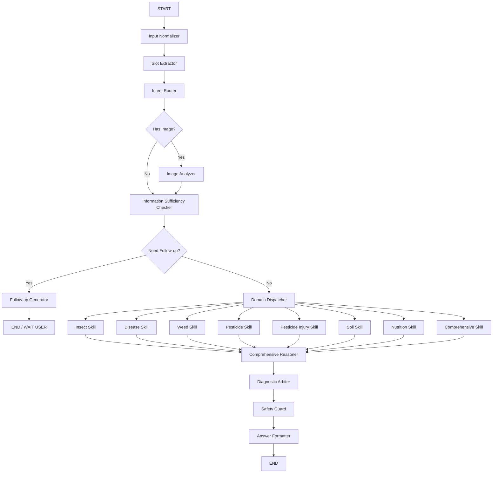

# Plant Protection Agent 构建说明文档

> 项目名称：Plant Protection Agent / 植保智能体  
> 技术框架：LangGraph  
> 目标场景：面向农技人员、农业生产管理人员、植保辅助决策场景  
> 核心能力：多模态输入、意图识别、多 Skill 路由、病虫草害/营养/土壤/农药等子系统调用、综合诊断、追问澄清、安全合规输出  
> 当前阶段：Agent 工程骨架与核心工作流构建阶段

---

# 1. 项目目标

本项目旨在构建一个基于 LangGraph 的农业植保智能体系统，使其能够接收用户的文字、图片等输入，识别用户意图，并根据问题类型路由到对应子 Skill，例如：

- 昆虫 / 虫害 Skill
- 病害 Skill
- 草害 Skill
- 农药 Skill
- 药害 Skill
- 土壤 Skill
- 营养诊断 Skill
- 综合植保诊断 Skill

系统不应只是一个普通农业问答机器人，而应具备以下能力：

1. 能识别用户输入中的多个潜在意图；
2. 能抽取作物、地区、季节、受害部位、症状、虫态、用药史、施肥史等关键诊断信息；
3. 能根据是否有图片调用多模态模型或图像识别工具；
4. 能在信息不足时主动追问，而不是强行给出高置信结论；
5. 能调用知识库、结构化数据库、图像识别工具、农药安全检查工具等；
6. 能对多个子 Skill 的结果进行综合诊断和仲裁；
7. 能在最终输出前进行安全合规检查；
8. 能生成适合农技人员阅读的结构化回答。

---

# 2. 核心设计原则

## 2.1 不做单轮问答，做诊断型工作流

植保问题通常不是“一问一答”，而是需要经过：

```text
信息收集 → 初步判断 → 工具调用 → 证据比对 → 追问澄清 → 综合诊断 → 安全输出
```

因此，系统应使用 LangGraph 的状态机能力，而不是简单 Chain。

---

## 2.2 支持多意图，而不是单一路由

真实用户问题经常同时包含多种可能：

示例：

```text
“番茄叶子发黄卷曲，还有很多小白虫，前几天刚打过药，这是怎么回事？”
```

可能涉及：

- 虫害：小白虫
- 病害：病毒病可能
- 药害：前几天打药
- 营养：叶片发黄
- 综合诊断：多因素共同作用

因此意图识别节点必须输出：

```json
{
  "primary_domain": "insect",
  "secondary_domains": ["disease", "pesticide_injury", "nutrition"],
  "need_multi_skill": true
}
```

---

## 2.3 视觉结果不是最终诊断

如果用户上传图片，多模态模型应优先完成：

- 图片质量判断
- 可见对象描述
- 虫体或病斑客观观察
- 危害部位描述
- 可能候选提示

但不能仅凭模糊图片直接高置信定种。

---

## 2.4 信息不足时必须追问

在以下场景中，系统应优先追问：

- 缺少作物信息；
- 图片模糊且用户未提供症状描述；
- 诊断涉及农药、药害、缺素但缺少用药史/施肥史；
- 多个候选结论证据接近；
- 低置信度但用户要求明确结论。

---

## 2.5 最终输出必须经过安全合规检查

尤其涉及农药、防治建议时，必须检查：

- 是否推荐禁限用农药；
- 是否给出无来源具体剂量；
- 是否扩大登记作物或防治对象；
- 是否在低置信诊断下直接建议用药；
- 是否缺少安全间隔期、标签、当地植保部门建议等提醒。

---

# 3. 推荐项目目录结构

```text
plant_protection_agent/
├── README.md
├── pyproject.toml
├── requirements.txt
├── .env.example
│
├── app/
│   ├── main.py
│   ├── config.py
│   └── api/
│       ├── routes.py
│       └── schemas.py
│
├── graph/
│   ├── build_graph.py
│   ├── state.py
│   ├── nodes/
│   │   ├── input_normalizer.py
│   │   ├── slot_extractor.py
│   │   ├── intent_router.py
│   │   ├── image_analyzer.py
│   │   ├── sufficiency_checker.py
│   │   ├── followup_generator.py
│   │   ├── domain_dispatcher.py
│   │   ├── comprehensive_reasoner.py
│   │   ├── diagnostic_arbiter.py
│   │   ├── safety_guard.py
│   │   └── answer_formatter.py
│   │
│   └── edges/
│       ├── routing_rules.py
│       └── conditions.py
│
├── skills/
│   ├── base.py
│   ├── insect/
│   │   ├── skill.py
│   │   ├── prompts.py
│   │   └── tools.py
│   ├── disease/
│   │   ├── skill.py
│   │   ├── prompts.py
│   │   └── tools.py
│   ├── weed/
│   │   ├── skill.py
│   │   ├── prompts.py
│   │   └── tools.py
│   ├── pesticide/
│   │   ├── skill.py
│   │   ├── prompts.py
│   │   └── tools.py
│   ├── pesticide_injury/
│   │   ├── skill.py
│   │   ├── prompts.py
│   │   └── tools.py
│   ├── soil/
│   │   ├── skill.py
│   │   ├── prompts.py
│   │   └── tools.py
│   ├── nutrition/
│   │   ├── skill.py
│   │   ├── prompts.py
│   │   └── tools.py
│   └── comprehensive/
│       ├── skill.py
│       ├── prompts.py
│       └── tools.py
│
├── tools/
│   ├── vision/
│   │   ├── vlm_client.py
│   │   ├── image_quality.py
│   │   └── pest_detector.py
│   ├── retrieval/
│   │   ├── vector_retriever.py
│   │   ├── keyword_retriever.py
│   │   ├── hybrid_retriever.py
│   │   └── reranker.py
│   ├── database/
│   │   ├── ontology_db.py
│   │   ├── crop_problem_db.py
│   │   ├── pesticide_db.py
│   │   └── occurrence_calendar.py
│   └── safety/
│       ├── pesticide_safety_checker.py
│       └── risk_expression_checker.py
│
├── knowledge/
│   ├── README.md
│   ├── ontology/
│   │   ├── pest_ontology.json
│   │   ├── disease_ontology.json
│   │   ├── weed_ontology.json
│   │   ├── nutrition_ontology.json
│   │   └── pesticide_ontology.json
│   ├── cards/
│   │   ├── pest_cards/
│   │   ├── disease_cards/
│   │   ├── weed_cards/
│   │   ├── nutrition_cards/
│   │   └── pesticide_cards/
│   └── sources/
│       ├── source_registry.json
│       └── staging/
│
├── prompts/
│   ├── global_system_prompt.md
│   ├── intent_router_prompt.md
│   ├── slot_extraction_prompt.md
│   ├── comprehensive_reasoning_prompt.md
│   ├── diagnostic_arbiter_prompt.md
│   ├── safety_guard_prompt.md
│   └── answer_formatter_prompt.md
│
├── tests/
│   ├── README.md
│   ├── test_cases/
│   │   ├── text_cases.jsonl
│   │   ├── image_text_cases.jsonl
│   │   ├── insufficient_info_cases.jsonl
│   │   ├── multi_intent_cases.jsonl
│   │   └── safety_cases.jsonl
│   └── eval/
│       ├── intent_eval.py
│       ├── slot_eval.py
│       ├── followup_eval.py
│       ├── diagnosis_eval.py
│       └── safety_eval.py
│
└── docs/
    ├── architecture.md
    ├── graph_design.md
    ├── state_schema.md
    ├── skill_protocol.md
    ├── tool_protocol.md
    ├── evaluation_plan.md
    └── safety_policy.md
```

---

# 4. LangGraph 总体工作流

## 4.1 主图流程

```text
START
  ↓
Input Normalizer
  ↓
Slot Extractor
  ↓
Intent Router
  ↓
Image Analyzer? 
  ├── 有图片 → Image Analyzer
  └── 无图片 → 跳过
  ↓
Information Sufficiency Checker
  ├── 信息不足 → Follow-up Generator → END / WAIT_USER
  └── 信息基本充分 → Domain Dispatcher
  ↓
Domain Skills
  ├── Insect Skill
  ├── Disease Skill
  ├── Weed Skill
  ├── Pesticide Skill
  ├── Pesticide Injury Skill
  ├── Soil Skill
  ├── Nutrition Skill
  └── Comprehensive Skill
  ↓
Comprehensive Reasoner
  ↓
Diagnostic Arbiter
  ↓
Safety Guard
  ↓
Answer Formatter
  ↓
END
```

---

## 4.2 Mermaid 流程图



---

# 5. 全局 State 设计

请在 `graph/state.py` 中定义统一状态对象。

```python
from typing import TypedDict, Optional, List, Dict, Any


class PlantProtectionState(TypedDict, total=False):
    # ========== 原始输入 ==========
    user_input: str
    image_paths: List[str]
    conversation_id: str
    user_id: Optional[str]
    current_date: Optional[str]

    # ========== 用户上下文 ==========
    user_role: Optional[str]  # farmer | technician | researcher | unknown
    location: Optional[str]
    language: Optional[str]

    # ========== 诊断槽位 ==========
    crop: Optional[str]
    region: Optional[str]
    season: Optional[str]
    growth_stage: Optional[str]

    damaged_parts: List[str]
    symptoms: List[str]
    field_distribution: Optional[str]

    pest_seen: Optional[bool]
    insect_stage: Optional[str]
    insect_morphology: List[str]

    disease_signs: List[str]
    weed_description: Optional[str]

    pesticide_history: Optional[str]
    fertilization_history: Optional[str]
    irrigation_history: Optional[str]
    soil_condition: Optional[str]
    weather_context: Optional[str]

    # ========== 意图与路由 ==========
    task_type: Optional[str]
    primary_domain: Optional[str]
    secondary_domains: List[str]
    all_domains: List[str]
    route_confidence: Optional[float]
    need_multi_skill: Optional[bool]

    # ========== 图片分析结果 ==========
    image_quality: Optional[str]
    image_observations: List[Dict[str, Any]]
    visual_candidates: List[Dict[str, Any]]

    # ========== 信息充分性 ==========
    missing_slots: List[str]
    critical_missing_slots: List[str]
    sufficiency_level: Optional[str]  # sufficient | partial | insufficient
    need_followup: Optional[bool]
    followup_questions: List[str]

    # ========== 各子 Skill 结果 ==========
    insect_result: Optional[Dict[str, Any]]
    disease_result: Optional[Dict[str, Any]]
    weed_result: Optional[Dict[str, Any]]
    pesticide_result: Optional[Dict[str, Any]]
    pesticide_injury_result: Optional[Dict[str, Any]]
    soil_result: Optional[Dict[str, Any]]
    nutrition_result: Optional[Dict[str, Any]]
    comprehensive_result: Optional[Dict[str, Any]]

    # ========== 证据与检索 ==========
    retrieved_docs: List[Dict[str, Any]]
    evidence_summary: Optional[str]

    # ========== 综合诊断 ==========
    candidate_diagnoses: List[Dict[str, Any]]
    final_diagnosis: Optional[Dict[str, Any]]
    uncertainty_level: Optional[str]  # low | medium | high
    confidence: Optional[float]

    # ========== 安全合规 ==========
    safety_warnings: List[str]
    unsafe_expressions: List[str]
    pesticide_safety_checked: Optional[bool]
    final_answer_allowed: Optional[bool]

    # ========== 最终输出 ==========
    final_answer: Optional[str]
    answer_format: Optional[str]  # concise | expert_report | followup
```

---

# 6. 节点设计说明

---

## 6.1 Input Normalizer

文件：

```text
graph/nodes/input_normalizer.py
```

职责：

1. 接收原始用户输入；
2. 标准化文本、图片路径、会话 ID、时间等；
3. 合并历史对话上下文；
4. 输出标准化 State。

输入：

```json
{
  "user_input": "番茄叶子发黄，还有小白虫",
  "image_paths": ["xxx.jpg"]
}
```

输出更新：

```json
{
  "user_input": "...",
  "image_paths": [...],
  "current_date": "...",
  "language": "zh"
}
```

---

## 6.2 Slot Extractor

文件：

```text
graph/nodes/slot_extractor.py
```

职责：

从用户输入中抽取植保诊断所需的通用槽位：

- 作物
- 地区
- 季节
- 生育期
- 受害部位
- 症状
- 是否看到虫
- 虫态 / 形态
- 用药史
- 施肥史
- 灌溉史
- 土壤状况
- 田间分布

输出示例：

```json
{
  "crop": "番茄",
  "symptoms": ["叶片发黄", "叶片卷曲"],
  "pest_seen": true,
  "insect_morphology": ["小白虫"],
  "pesticide_history": "前几天打过药"
}
```

---

## 6.3 Intent Router

文件：

```text
graph/nodes/intent_router.py
```

职责：

识别用户问题属于哪些植保子领域。

支持领域：

```text
insect
disease
weed
pesticide
pesticide_injury
soil
nutrition
comprehensive
general_agriculture
out_of_scope
```

输出必须支持多意图。

输出格式：

```json
{
  "task_type": "diagnosis",
  "primary_domain": "insect",
  "secondary_domains": ["disease", "pesticide_injury", "nutrition"],
  "all_domains": ["insect", "disease", "pesticide_injury", "nutrition"],
  "route_confidence": 0.78,
  "need_multi_skill": true
}
```

注意：

- 不要只输出单个 domain；
- 如果存在多种可能，应保留 secondary_domains；
- 如果用户明确询问用药，应包含 pesticide；
- 如果用户提到“打药后出现症状”，应包含 pesticide_injury；
- 如果用户描述“发黄、缺绿、叶脉间黄化”，应考虑 nutrition；
- 如果用户上传图片但文本不明确，也应进入 comprehensive。

---

## 6.4 Image Analyzer

文件：

```text
graph/nodes/image_analyzer.py
```

职责：

当用户提供图片时，调用多模态模型或图像工具。

输出内容：

1. 图片质量；
2. 可见作物部位；
3. 可见虫体 / 病斑 / 杂草 / 土壤问题；
4. 客观视觉观察；
5. 视觉候选；
6. 不确定性说明。

输出示例：

```json
{
  "image_quality": "medium",
  "image_observations": [
    {
      "image_id": "image_001",
      "visible_parts": ["叶片背面"],
      "observed_features": ["可见小型白色昆虫", "叶片轻度黄化"],
      "limitations": ["虫体细节不清晰"]
    }
  ],
  "visual_candidates": [
    {
      "domain": "insect",
      "candidate": "粉虱类",
      "confidence": 0.62,
      "basis": "叶背可见小型白色虫体"
    }
  ]
}
```

约束：

- 不要仅凭图片直接输出最终诊断；
- 对模糊图片必须降低置信度；
- 必须明确图片局限性。

---

## 6.5 Information Sufficiency Checker

文件：

```text
graph/nodes/sufficiency_checker.py
```

职责：

判断当前信息是否足够进入诊断流程。

需要考虑：

- 是否有作物；
- 是否有症状；
- 是否有受害部位；
- 是否有图片或形态描述；
- 是否有地区/季节；
- 如果涉及药害，是否有用药史；
- 如果涉及缺素，是否有施肥史/土壤信息；
- 如果涉及防治建议，是否有发生程度。

输出示例：

```json
{
  "sufficiency_level": "partial",
  "need_followup": true,
  "missing_slots": ["region", "growth_stage"],
  "critical_missing_slots": ["crop"]
}
```

策略：

```text
如果 crop 缺失且问题是诊断型 → 必须追问
如果图片极差且文本症状不足 → 必须追问
如果只是知识问答型问题 → 不必强制追问
如果信息部分充分 → 可以给初判 + 请求补充
```

---

## 6.6 Follow-up Generator

文件：

```text
graph/nodes/followup_generator.py
```

职责：

生成简洁、优先级明确的追问。

追问原则：

1. 一次最多问 3 个关键问题；
2. 优先问影响最大的信息；
3. 不要机械列出所有缺失字段；
4. 可引导用户上传特定类型图片。

示例输出：

```text
目前信息还不足以做高置信判断。请优先补充：
1. 这是什么作物？处于哪个生育期？
2. 发生地区和大致时间？
3. 请补充一张受害部位近照和一张全株/田间分布照片。
```

---

## 6.7 Domain Dispatcher

文件：

```text
graph/nodes/domain_dispatcher.py
```

职责：

根据 `all_domains` 调用对应子 Skill。

规则：

```text
如果 only insect → 调用 Insect Skill
如果 insect + disease → 调用 Insect Skill 和 Disease Skill
如果 pesticide_injury 存在 → 必须调用 Pesticide Injury Skill
如果 nutrition 存在 → 调用 Nutrition Skill
如果 all_domains 数量 >= 2 → 后续必须进入 Comprehensive Reasoner
```

输出：

将各子 Skill 结果写入对应 State 字段。

---

# 7. 子 Skill 标准协议

每个子 Skill 必须遵守统一输入输出协议。

---

## 7.1 Skill 输入

每个 Skill 接收完整 State，但只读取自己需要的信息。

```python
def run_skill(state: PlantProtectionState) -> dict:
    ...
```

---

## 7.2 Skill 输出标准

每个 Skill 输出必须是结构化 JSON，而不是直接自然语言长回答。

```json
{
  "domain": "insect",
  "status": "completed",
  "candidates": [
    {
      "name": "候选对象",
      "type": "pest/disease/nutrition/soil/pesticide_injury",
      "confidence": 0.72,
      "evidence": [
        "与作物匹配",
        "与症状匹配"
      ],
      "against_evidence": [
        "缺少清晰虫体特征"
      ],
      "need_more_info": true,
      "recommended_observations": [
        "观察叶背是否有蜜露",
        "补充虫体近照"
      ]
    }
  ],
  "retrieved_evidence": [
    {
      "source_id": "SRC_xxxx",
      "title": "来源标题",
      "snippet": "证据片段"
    }
  ],
  "risk_notes": [
    "当前不建议直接用药，应先确认发生程度"
  ],
  "followup_questions": [
    "是否可见虫粪或蜜露？"
  ]
}
```

---

## 7.3 Insect Skill

职责：

- 判断是否为虫害；
- 结合图片、作物、症状生成候选害虫；
- 查询害虫知识卡片；
- 做相似害虫鉴别；
- 给出虫害相关调查建议；
- 不直接给具体农药剂量。

---

## 7.4 Disease Skill

职责：

- 判断真菌、细菌、病毒、生理性病害可能；
- 结合病斑形态、部位、扩展方式、环境条件；
- 输出候选病害；
- 与虫害、药害、缺素进行区分。

---

## 7.5 Weed Skill

职责：

- 识别杂草类问题；
- 支持杂草形态描述、作物田场景、除草剂风险；
- 可调用杂草知识库和图片识别工具。

---

## 7.6 Pesticide Skill

职责：

- 回答农药知识、作用机制、登记对象、安全间隔期、抗药性轮换等；
- 必须调用安全检查工具；
- 没有可靠登记数据时，不给具体剂量。

---

## 7.7 Pesticide Injury Skill

职责：

- 判断是否可能为药害；
- 重点读取用药史、时间间隔、天气、作物生育期；
- 与病害、缺素、虫害进行区分。

---

## 7.8 Soil Skill

职责：

- 处理土壤板结、盐渍化、酸碱度、根系环境、排水等问题；
- 与营养缺素和根部病害联动。

---

## 7.9 Nutrition Skill

职责：

- 判断缺氮、缺磷、缺钾、缺镁、缺铁等营养问题；
- 结合叶片部位、新老叶表现、叶脉间黄化等特征；
- 与病害、药害、土壤问题区分。

---

## 7.10 Comprehensive Skill

职责：

- 处理明显跨领域问题；
- 汇总虫害、病害、药害、营养、土壤等可能；
- 输出多因素假设。

---

# 8. 综合节点设计

本项目必须重点构建以下综合节点：

---

## 8.1 Comprehensive Reasoner

文件：

```text
graph/nodes/comprehensive_reasoner.py
```

职责：

在多个子 Skill 返回结果后，进行综合思考。

它不是最终裁判，而是负责整合信息。

输入：

- insect_result
- disease_result
- pesticide_injury_result
- nutrition_result
- soil_result
- image_observations
- slots
- retrieved_docs

输出：

```json
{
  "candidate_diagnoses": [
    {
      "diagnosis": "虫害为主，伴随病毒病风险",
      "related_domains": ["insect", "disease"],
      "confidence": 0.68,
      "supporting_evidence": [
        "叶背可见小型白色虫体",
        "叶片卷曲和黄化可与刺吸式害虫相关"
      ],
      "conflicting_evidence": [
        "缺少虫体近照",
        "未确认是否有病毒病典型症状"
      ],
      "needs_followup": true
    }
  ],
  "reasoning_summary": "当前更倾向虫害相关，但需排除病毒病和药害。"
}
```

---

## 8.2 Diagnostic Arbiter

文件：

```text
graph/nodes/diagnostic_arbiter.py
```

职责：

从候选诊断中形成最终诊断策略。

它需要判断：

1. 主因是什么；
2. 次因是什么；
3. 哪些因素需要排除；
4. 是否可以给出诊断；
5. 是否只能给出候选；
6. 是否需要再次追问；
7. 是否可以给出防控建议。

输出：

```json
{
  "final_diagnosis": {
    "primary_conclusion": "较可能为虫害相关问题",
    "secondary_possibilities": ["病毒病风险", "药害待排除"],
    "confidence": 0.66,
    "certainty_label": "中等置信",
    "key_evidence": [
      "图片中可见小型白色虫体",
      "用户描述叶片黄化卷曲"
    ],
    "limitations": [
      "缺少地区",
      "缺少清晰虫体照片",
      "缺少用药名称和时间"
    ],
    "next_best_actions": [
      "补充叶背虫体近照",
      "调查是否有蜜露或煤污",
      "记录近期用药信息"
    ]
  },
  "need_followup": false
}
```

---

## 8.3 Safety Guard

文件：

```text
graph/nodes/safety_guard.py
```

职责：

最终回答前的安全合规检查。

检查项：

- 是否出现禁限用农药；
- 是否出现具体剂量；
- 是否出现“保证防治”“一定是”等过强表述；
- 是否在低置信度时给出高风险操作；
- 是否缺少农药标签和当地植保部门提醒；
- 是否缺少安全间隔期提醒。

输出：

```json
{
  "pesticide_safety_checked": true,
  "final_answer_allowed": true,
  "safety_warnings": [
    "不建议在未确认虫种和发生程度前直接用药",
    "如需用药，应以当地登记标签和植保部门建议为准"
  ],
  "unsafe_expressions": []
}
```

如果发现风险，应要求 Answer Formatter 修改表达。

---

## 8.4 Answer Formatter

文件：

```text
graph/nodes/answer_formatter.py
```

职责：

将最终诊断、安全提示、证据和追问整理为用户可读结果。

面向农技人员的推荐输出格式：

```text
1. 初步判断
2. 置信度
3. 关键依据
4. 需要排除的可能
5. 建议补充的信息
6. 田间调查建议
7. 综合防控建议
8. 用药与安全提示
9. 参考依据
```

注意：

- 不要输出过长；
- 不要伪造参考来源；
- 不要把候选说成确定结论；
- 不要在没有登记数据时输出具体药剂剂量。

---

# 9. Prompt 文件要求

---

## 9.1 全局系统 Prompt

文件：

```text
prompts/global_system_prompt.md
```

应包含：

```text
你是一个农业植保智能体，服务对象主要是农技人员和农业生产管理人员。
你需要基于作物、地区、季节、生育期、受害部位、症状、图片信息和用户补充信息进行诊断。
你不能在信息不足时强行给出高置信结论。
你不能推荐禁限用农药。
你不能在没有可靠来源时给出具体农药剂量。
你应优先采用综合防控思路。
```

---

## 9.2 Intent Router Prompt

文件：

```text
prompts/intent_router_prompt.md
```

必须要求模型输出 JSON：

```json
{
  "task_type": "",
  "primary_domain": "",
  "secondary_domains": [],
  "all_domains": [],
  "route_confidence": 0.0,
  "need_multi_skill": false,
  "reason": ""
}
```

---

## 9.3 Slot Extraction Prompt

文件：

```text
prompts/slot_extraction_prompt.md
```

必须要求抽取：

- crop
- region
- season
- growth_stage
- damaged_parts
- symptoms
- pest_seen
- insect_stage
- insect_morphology
- pesticide_history
- fertilization_history
- irrigation_history
- soil_condition
- field_distribution

---

## 9.4 Comprehensive Reasoning Prompt

文件：

```text
prompts/comprehensive_reasoning_prompt.md
```

要求模型：

1. 汇总各子 Skill 结果；
2. 找出一致证据；
3. 找出冲突证据；
4. 判断是否可能多因素共同作用；
5. 输出候选诊断列表；
6. 标注不确定性。

---

## 9.5 Diagnostic Arbiter Prompt

文件：

```text
prompts/diagnostic_arbiter_prompt.md
```

要求模型：

1. 选择主诊断；
2. 保留次要可能；
3. 明确待排除项；
4. 判断是否需要追问；
5. 输出最终诊断 JSON。

---

## 9.6 Safety Guard Prompt

文件：

```text
prompts/safety_guard_prompt.md
```

要求检查：

- 禁限用药；
- 无来源剂量；
- 过强判断；
- 低置信高风险操作；
- 是否缺少安全提示。

---

# 10. 工具调用设计

---

## 10.1 视觉工具

```python
def assess_image_quality(image_path: str) -> dict:
    """评估图片清晰度、主体可见性、是否适合诊断。"""


def analyze_image_with_vlm(image_path: str, prompt: str) -> dict:
    """调用开源多模态模型，输出客观观察结果。"""


def detect_pest_candidate(image_path: str) -> dict:
    """可选：调用专用害虫识别模型，输出 Top-K 候选。"""
```

---

## 10.2 知识检索工具

```python
def retrieve_knowledge_cards(query: str, domain: str, filters: dict) -> list:
    """检索知识卡片。"""


def hybrid_search(query: str, filters: dict) -> list:
    """混合检索：关键词 + 向量 + rerank。"""


def query_ontology(entity_name: str, domain: str) -> dict:
    """查询统一实体本体库。"""
```

---

## 10.3 农药安全工具

```python
def query_pesticide_registration(crop: str, target: str) -> list:
    """查询农药登记信息。"""


def check_pesticide_safety(answer: str, context: dict) -> dict:
    """检查回答中的农药安全风险。"""
```

---

## 10.4 信息充分性工具

```python
def check_required_slots(state: dict) -> dict:
    """根据任务类型和领域判断缺失槽位。"""
```

---

# 11. 路由规则

---

## 11.1 是否进入 Image Analyzer

```python
def should_analyze_image(state):
    return bool(state.get("image_paths"))
```

---

## 11.2 是否追问

```python
def should_followup(state):
    return state.get("need_followup") is True and state.get("sufficiency_level") == "insufficient"
```

---

## 11.3 是否多 Skill

```python
def should_use_multi_skill(state):
    domains = state.get("all_domains", [])
    return len(domains) >= 2 or state.get("need_multi_skill") is True
```

---

## 11.4 是否进入安全检查

所有最终回答都必须进入 Safety Guard。

```python
def should_safety_check(state):
    return True
```

---

# 12. LangGraph 构建伪代码

文件：

```text
graph/build_graph.py
```

示例：

```python
from langgraph.graph import StateGraph, END
from graph.state import PlantProtectionState

from graph.nodes.input_normalizer import input_normalizer
from graph.nodes.slot_extractor import slot_extractor
from graph.nodes.intent_router import intent_router
from graph.nodes.image_analyzer import image_analyzer
from graph.nodes.sufficiency_checker import sufficiency_checker
from graph.nodes.followup_generator import followup_generator
from graph.nodes.domain_dispatcher import domain_dispatcher
from graph.nodes.comprehensive_reasoner import comprehensive_reasoner
from graph.nodes.diagnostic_arbiter import diagnostic_arbiter
from graph.nodes.safety_guard import safety_guard
from graph.nodes.answer_formatter import answer_formatter

from graph.edges.conditions import (
    has_image,
    need_followup,
)


def build_plant_protection_graph():
    graph = StateGraph(PlantProtectionState)

    graph.add_node("input_normalizer", input_normalizer)
    graph.add_node("slot_extractor", slot_extractor)
    graph.add_node("intent_router", intent_router)
    graph.add_node("image_analyzer", image_analyzer)
    graph.add_node("sufficiency_checker", sufficiency_checker)
    graph.add_node("followup_generator", followup_generator)
    graph.add_node("domain_dispatcher", domain_dispatcher)
    graph.add_node("comprehensive_reasoner", comprehensive_reasoner)
    graph.add_node("diagnostic_arbiter", diagnostic_arbiter)
    graph.add_node("safety_guard", safety_guard)
    graph.add_node("answer_formatter", answer_formatter)

    graph.set_entry_point("input_normalizer")

    graph.add_edge("input_normalizer", "slot_extractor")
    graph.add_edge("slot_extractor", "intent_router")

    graph.add_conditional_edges(
        "intent_router",
        has_image,
        {
            "yes": "image_analyzer",
            "no": "sufficiency_checker"
        }
    )

    graph.add_edge("image_analyzer", "sufficiency_checker")

    graph.add_conditional_edges(
        "sufficiency_checker",
        need_followup,
        {
            "yes": "followup_generator",
            "no": "domain_dispatcher"
        }
    )

    graph.add_edge("followup_generator", END)

    graph.add_edge("domain_dispatcher", "comprehensive_reasoner")
    graph.add_edge("comprehensive_reasoner", "diagnostic_arbiter")
    graph.add_edge("diagnostic_arbiter", "safety_guard")
    graph.add_edge("safety_guard", "answer_formatter")
    graph.add_edge("answer_formatter", END)

    return graph.compile()
```

---

# 13. 子 Skill 调用策略

在 `domain_dispatcher.py` 中实现：

```python
def domain_dispatcher(state):
    domains = state.get("all_domains", [])

    if "insect" in domains:
        state["insect_result"] = run_insect_skill(state)

    if "disease" in domains:
        state["disease_result"] = run_disease_skill(state)

    if "weed" in domains:
        state["weed_result"] = run_weed_skill(state)

    if "pesticide" in domains:
        state["pesticide_result"] = run_pesticide_skill(state)

    if "pesticide_injury" in domains:
        state["pesticide_injury_result"] = run_pesticide_injury_skill(state)

    if "soil" in domains:
        state["soil_result"] = run_soil_skill(state)

    if "nutrition" in domains:
        state["nutrition_result"] = run_nutrition_skill(state)

    if len(domains) >= 2 or state.get("need_multi_skill"):
        state["comprehensive_result"] = run_comprehensive_skill(state)

    return state
```

---

# 14. 最终回答格式

默认输出格式：

```text
## 1. 初步判断

根据当前信息，较可能为：{结论}。

置信度：{高/中/低}

## 2. 关键依据

- {依据1}
- {依据2}
- {依据3}

## 3. 需要排除的可能

- {可能1}：原因……
- {可能2}：原因……

## 4. 建议补充的信息

- {补充1}
- {补充2}

## 5. 田间调查建议

- {调查建议1}
- {调查建议2}

## 6. 综合防控建议

- 优先进行监测和确认；
- 结合农业防治、物理防治、生物防治；
- 达到当地防治指标后，再考虑化学防治。

## 7. 用药与安全提示

如需用药，应以当地植保部门建议和农药标签为准，确认登记作物、防治对象、安全间隔期和使用方法。当前不建议在诊断未确认前直接用药。

## 8. 参考依据

- {来源1}
- {来源2}
```

---

# 15. 评测体系

必须建立测试集和评测脚本。

## 15.1 测试集类型

```text
tests/test_cases/text_cases.jsonl
tests/test_cases/image_text_cases.jsonl
tests/test_cases/insufficient_info_cases.jsonl
tests/test_cases/multi_intent_cases.jsonl
tests/test_cases/safety_cases.jsonl
```

---

## 15.2 核心评测指标

| 模块 | 指标 |
|---|---|
| 意图识别 | 是否正确识别主意图和次意图 |
| 槽位抽取 | 作物、症状、地区、用药史等是否正确 |
| 图片观察 | 是否客观描述，是否过度判断 |
| 追问机制 | 是否追问最关键缺失信息 |
| 子 Skill 调用 | 是否调用正确工具和知识库 |
| 综合诊断 | 是否合理整合多领域结果 |
| 安全合规 | 是否避免高风险用药建议 |
| 最终输出 | 是否清晰、专业、结构化 |

---

# 16. MVP 实施阶段

---

## MVP 0：文本诊断工作流

目标：

- 跑通 LangGraph 主流程；
- 支持文本输入；
- 完成意图识别、槽位抽取、追问和结构化回答；
- 子 Skill 可以先用 Mock 结果。

---

## MVP 1：昆虫 + 病害双 Skill

目标：

- 实现 Insect Skill 和 Disease Skill；
- 接入基础知识卡片；
- 支持多意图路由；
- 实现综合诊断节点。

---

## MVP 2：图片输入与多模态观察

目标：

- 接入开源 VLM；
- 实现图片质量评估；
- 输出客观视觉观察；
- 与文本诊断合并。

---

## MVP 3：农药与安全合规

目标：

- 接入农药登记数据或 Mock 数据；
- 实现安全合规检查；
- 拒绝无依据具体剂量和高风险建议。

---

## MVP 4：完整植保系统扩展

目标：

- 增加草害、土壤、营养、药害等 Skill；
- 完善知识库；
- 建立评测集；
- 支持多轮会话和历史案例追踪。

---

# 17. 当前阶段 Agent 执行任务

请构建本项目的第一阶段工程骨架。

## 17.1 当前阶段目标

只搭建 Agent 框架，不要求接入真实模型和真实知识库。

允许：

- 创建目录结构；
- 创建 State；
- 创建 LangGraph 主图；
- 创建节点函数占位；
- 创建子 Skill 协议；
- 创建 Prompt 模板；
- 创建 Mock 工具；
- 创建测试样例结构；
- 创建 README 和架构文档。

不允许：

- 爬取网站；
- 导入大型数据集；
- 写入真实农药推荐；
- 伪造知识来源；
- 强行填充大量真实病虫害知识；
- 实现不可控的自动联网逻辑。

---

## 17.2 当前阶段应交付文件

优先创建：

```text
graph/state.py
graph/build_graph.py
graph/nodes/*.py
graph/edges/conditions.py
skills/base.py
skills/insect/skill.py
skills/disease/skill.py
skills/comprehensive/skill.py
prompts/*.md
tools/vision/*.py
tools/retrieval/*.py
tools/safety/*.py
docs/architecture.md
docs/graph_design.md
docs/state_schema.md
tests/README.md
README.md
```

---

## 17.3 节点函数当前可使用 Mock 逻辑

例如：

```python
def intent_router(state):
    text = state.get("user_input", "")
    domains = []

    if any(word in text for word in ["虫", "害虫", "幼虫", "成虫"]):
        domains.append("insect")

    if any(word in text for word in ["病斑", "霉", "腐烂", "病毒"]):
        domains.append("disease")

    if any(word in text for word in ["药", "打药", "喷药"]):
        domains.append("pesticide_injury")

    if any(word in text for word in ["发黄", "缺素", "叶脉"]):
        domains.append("nutrition")

    if not domains:
        domains = ["comprehensive"]

    state["primary_domain"] = domains[0]
    state["secondary_domains"] = domains[1:]
    state["all_domains"] = domains
    state["need_multi_skill"] = len(domains) > 1
    state["route_confidence"] = 0.6

    return state
```

注意：Mock 逻辑仅用于跑通流程，后续需要替换为 LLM + Prompt 的结构化输出。

---

# 18. 开发注意事项

1. 所有节点都应接收并返回 `PlantProtectionState`；
2. 节点之间不要传自然语言大段文本作为唯一信息，应尽量结构化；
3. 子 Skill 不直接生成最终回答，只返回结构化候选；
4. 最终回答必须由 Answer Formatter 统一生成；
5. 所有涉及农药内容必须经过 Safety Guard；
6. 信息不足时优先追问；
7. 多意图场景必须进入综合诊断；
8. 图片分析结果只能作为证据之一；
9. 不要伪造参考资料；
10. 保持代码轻量，优先跑通 LangGraph 主链路。

---

# 19. 后续扩展方向

后续可逐步加入：

- Qwen2.5-VL / InternVL 等开源多模态模型；
- bge-m3 / bge-reranker 等检索模型；
- Qdrant / Milvus 向量库；
- PostgreSQL 结构化知识库；
- 农药登记数据库；
- AP162 / IP102 等害虫图像模型；
- 官方病虫害资料 RAG；
- 多轮会话 Memory；
- 专家审核后台；
- 诊断报告导出；
- 农技人员案例库。

---

# 20. 项目一句话总结

本项目要构建的不是普通农业聊天机器人，而是一个：

```text
基于 LangGraph 的多模态、多 Skill、可追问、可仲裁、可安全约束的植保专业智能体。
```

其核心价值在于：

```text
将植保专家诊断流程、领域知识、图像观察、工具调用和安全规则，统一编排为可扩展的 Agent 工作流。
```
```